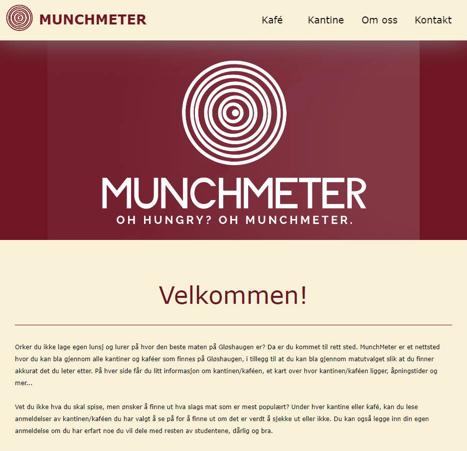
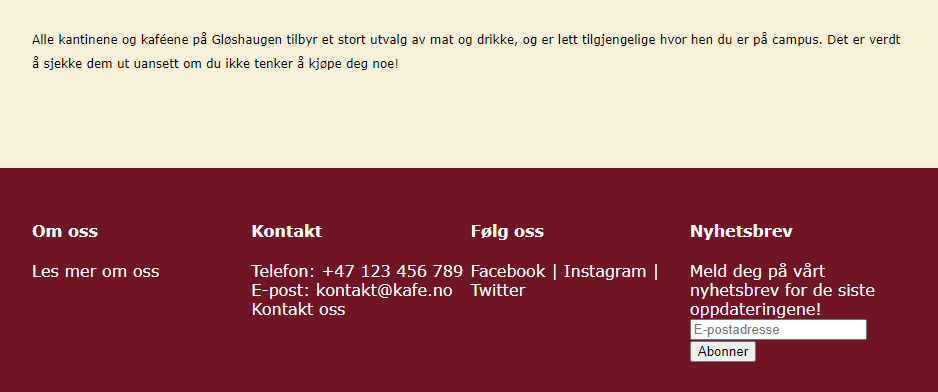

# Project Overview 

This project is part of the Web Technology course at NTNU, where the task is to create a website for an imaginary client. The goal of this project is to develop a website for the cafeterias and coffee shops on the Gløshaugen Campus, focusing on those with the best food selection. The purpose is to provide a simple and efficient solution for users to discover which dining options on campus offer the best food variety. The website will offer an overview of the cafeteria, kiosk, and coffee shop options on Gløshaugen, complete with reviews, menus, and opening hours.

## Specific Features 
- **User Reviews:** Users will be able to submit their own reviews and assign a star rating to each dining option.
- **Navigation:** The website will include a menu with links to different cafeterias and their food offerings.
- **Refresh Functionality:** Users can refresh the reviews to view other users' feedback, which will be displayed in random order.
- **Mobile Version:** The website will be optimized for mobile devices, ensuring a seamless user experience across all screen sizes.
- **Mazemap Integration:** The website will feature an integrated Mazemap, allowing users to easily locate the cafeterias on campus.

## Project Details 
This is a team project, and collaboration is essential for successfully delivering all phases of the project.

## Project Requirements
The project requirements focus on defining the problem that needs to be solved, not the design of the solution. This means that the requirements pertain to the content and organization of the website rather than its visual design.

## Scope 
The scope of the website must be manageable within a semester. The project should be substantial enough to meet course objectives yet achievable before the deadlines. There are no limitations on the number of pages the website can have, but it is important to ensure that all necessary pages are included and that there are no redundant ones. The website must include text, images, and graphical decorations (CSS) and must be responsive across different devices.

## Technical Constraints 
- **No Databases:** The use of databases is prohibited.
- **No Advanced Web Technologies:** The project must be built using only pure HTML, CSS, and JavaScript. Technologies such as jQuery and others are not allowed.
- **Form Handling:** If the website includes forms or email-sending features, they should simulate the sending process by displaying feedback messages such as “You have sent the message.”

## Image of the homepage

